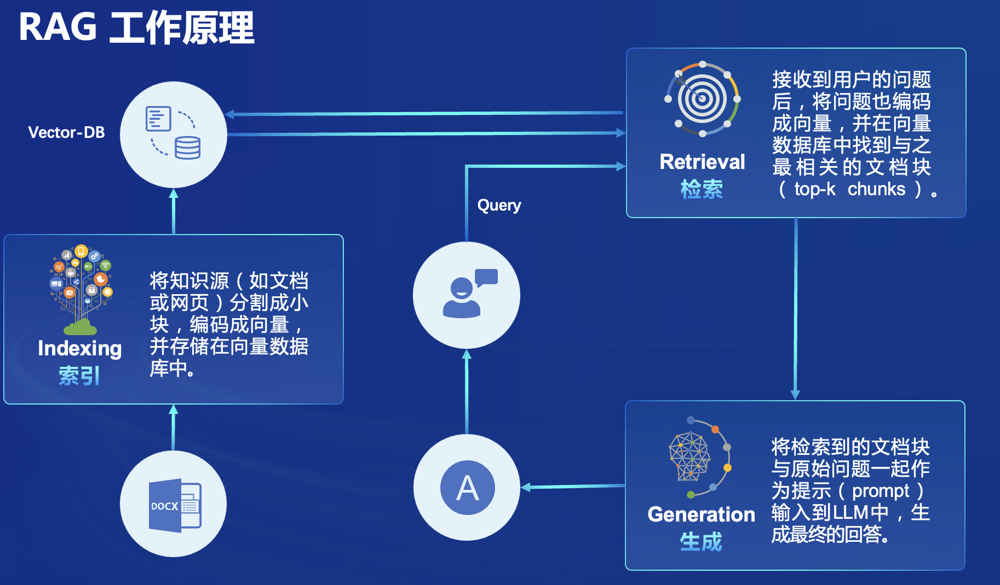

# 医疗助手

## 项目介绍
本项目旨在开发一个基于茴香豆RAG框架和internlm2-7B大模型的医疗助手，帮助患者和医生了解疾病信息和诊断流程。目标是使患者能够提前了解疾病信息，减少恐惧，并提高医生的诊断效率。
首先，收集和处理医学文献、疾病百科和诊断指南等数据，确保数据准确性和规范性。然后，使用这些数据对internlm2-7B模型进行初步训练和微调，确保模型能够生成高质量的医疗回答。并使用收集的治疗指南构建向量知识库，使用多路召回机制+重排机制来提高向量知识库的检索的命中率。项目实施过程中，将重视数据隐私保护和伦理审查，确保用户数据安全，系统回答准确可靠。
---

## 相关技术

RAG（Retrieval Augmented Generation）技术，通过检索与用户输入相关的信息片段，并结合外部知识库来生成更准确、更丰富的回答。解决 LLMs 在处理知识密集型任务时可能遇到的挑战, 如幻觉、知识过时和缺乏透明、可追溯的推理过程等。提供更准确的回答、降低推理成本、实现外部记忆。
---

## 架构图

---

## 应用搭建
### clone仓库
将项目clone到本地

```sh
git clone https://github.com/aizhweiwei/super-agent.git
```

### 创建环境
建议创建一个虚拟环境，然后安装依赖包

```sh
conda create --name superagent python=3.10

conda activate superagent
cd super-agent
pip install -r requirements.txt
```

### 安装其他软件
首先安装git和git-lfs
```sh
sudo apt install git
sudo apt install git-lfs
```

### 一键启动服务
``` sh
python3 app.py
```
在启动过程中，会下载相关模型，这个时间会比较久，你也可以注释相关下载模型代码，并提前下载相关模型，同时修改config.ini文件配置模型位置

### 非一键启动
1、注释app.py下载模型文件代码
```python
# download internlm2 to the base_path directory using git tool
# base_path = './final_model'
# os.system(f'git clone https://code.openxlab.org.cn/bob12/MedicalAssistant_internlm-7B.git {base_path}')
# embedding_path = './bce-embedding-base_v1'
# os.system(f'git clone https://www.modelscope.cn/maple77/bce-embedding-base_v1.git {embedding_path}')
# reranker_path = './bce-reranker-base_v1'
# os.system(f'git clone https://www.modelscope.cn/maple77/bce-reranker-base_v1.git {reranker_path}')
# os.system(f'cd {base_path} && git lfs pull')
# os.system(f'cd {embedding_path} && git lfs pull')
# os.system(f'cd {reranker_path} && git lfs pull')
```
2、下载模型
```sh
git clone https://code.openxlab.org.cn/bob12/MedicalAssistant_internlm-7B.git
git clone https://www.modelscope.cn/maple77/bce-embedding-base_v1.git
git clone https://www.modelscope.cn/maple77/bce-reranker-base_v1.git

```

3、修改config.ini文件
```bash
embedding_model_path = "/group_share/model/bce-embedding-base_v1"
reranker_model_path = "/group_share/model/bce-reranker-base_v1"
local_llm_path = "/group_share/model/final_model"

```
将上面路径修改你下载的路径，最好使用绝对路径

4、启动
``` sh
python3 app.py
```
---

## 致谢

***感谢 上海人工智能实验室 组织的书生·浦语大模型实战营学习活动 和 提供的强大算力支持~***

***感谢 OpenXLab 对项目部署的算力支持~***

***感谢 浦语小助手 对项目的支持~***